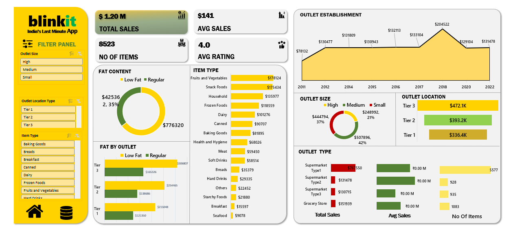
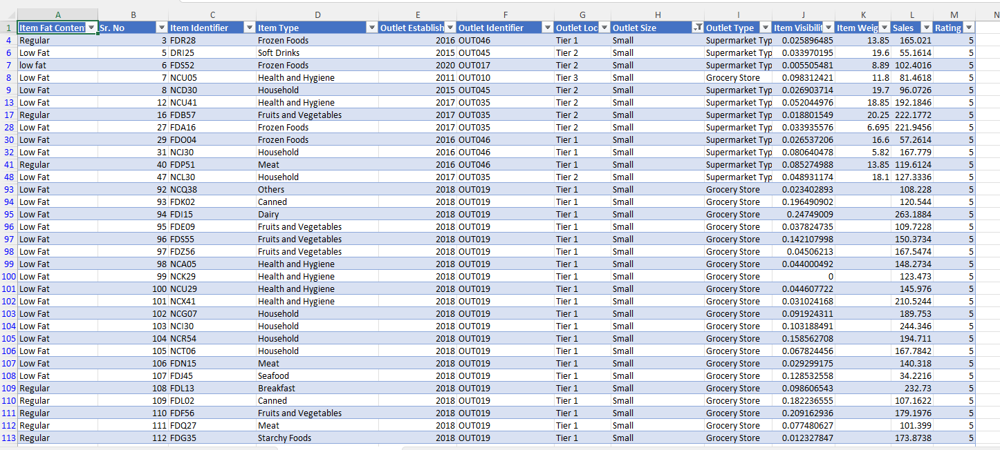

# Blinkit Grocery Sales Dashboard (Microsoft Excel)

## 📌 Project Overview

This project is an interactive sales dashboard built in **Microsoft Excel** to analyze Blinkit's grocery sales data. The dashboard provides valuable business insights through KPIs, Pivot Tables, Pivot Charts, and Slicers, enabling users to explore sales performance across different product categories and outlet characteristics.

The project demonstrates Excel data analysis and dashboard development skills using a real-world retail dataset.

---

## 📊 Dashboard Preview

### Dashboard



### Dataset



---

## 🎯 Objectives

- Analyze overall sales performance
- Track average sales and customer ratings
- Compare outlet performance
- Analyze sales by outlet size and location
- Understand product category performance
- Provide interactive filtering for better business analysis

---

## 📈 Key Performance Indicators (KPIs)

- **Total Sales**
- **Average Sales**
- **Number of Items Sold**
- **Average Rating**

---

## 📊 Dashboard Features

- Interactive Slicers
- Pivot Tables
- Pivot Charts
- KPI Cards
- Outlet-wise Sales Analysis
- Outlet Establishment Trend
- Sales by Item Type
- Sales by Fat Content
- Sales by Outlet Size
- Sales by Outlet Location
- Outlet Type Comparison

---

## 🛠 Tools Used

- Microsoft Excel
- Pivot Tables
- Pivot Charts
- Slicers
- Data Cleaning
- Conditional Formatting
- Dashboard Design

---

## 📂 Repository Structure

```
Blinkit-Excel-Dashboard/
│
├── Blinkit.xlsx
├── README.md
└── images/
    ├── Dashboard.png
    └── Dataset.png
```

---

## 📁 Dataset Information

The dataset contains **8,523 grocery products** with attributes such as:

- Item Identifier
- Item Type
- Fat Content
- Outlet Type
- Outlet Size
- Outlet Location
- Outlet Establishment Year
- Item Visibility
- Item Weight
- Sales
- Rating

---

## 💡 Business Insights

The dashboard helps answer questions like:

- Which outlet type generates the highest sales?
- Which product categories contribute the most revenue?
- How does outlet size affect sales?
- Which outlet locations perform better?
- How have sales changed across outlet establishment years?
- What is the average customer rating across products?

---

## 🚀 Skills Demonstrated

- Microsoft Excel
- Data Cleaning
- Data Analysis
- Dashboard Development
- Business Intelligence
- Data Visualization
- Pivot Tables
- Pivot Charts
- Slicer Implementation
- KPI Design

---

## 👩‍💻 Author

**Bhavyashree**

If you found this project useful, feel free to ⭐ the repository.
